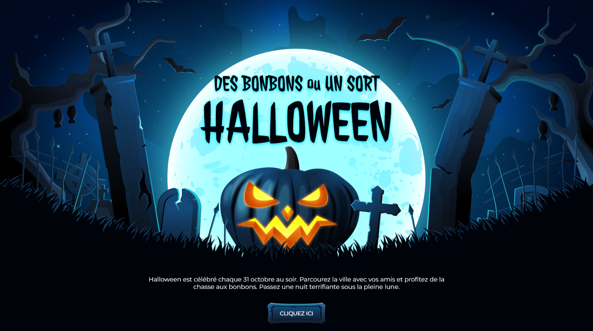

<div align="center">  
  <a href="https://background-animation-halloween-1.netlify.app/" target="_blank">  
      
  </a>  
  </br></br>  
  <h3 align="center">🕸️ Animation de Fond &nbsp;–&nbsp; Halloween 1</h3>  
</div>

## <br /> 📌 Sommaire

&nbsp;&nbsp;&nbsp; 🎨 &nbsp; [**Introduction**](#introduction)<br />
&nbsp;&nbsp;&nbsp; 🛠️ &nbsp; [**Technologies**](#technologies)<br />
&nbsp;&nbsp;&nbsp; 🎯 &nbsp; [**Fonctionnalités**](#fonctionnalités)<br />
&nbsp;&nbsp;&nbsp; 🚀 &nbsp; [**Installation**](#installation)<br />

## <br /> <a name="introduction">🎨 Introduction</a>

Landing page immersive sur le thème d’Halloween, animée avec **GSAP**. Citrouilles, arbres et lune en mouvement créent une atmosphère sombre et captivante.

Idéale pour des événements saisonniers, promotions à thème ou pages dédiées à l’univers de l’horreur, elle mêle animations visuelles, bouton d’appel à l’action effrayant et design 100 % responsive.

## <br /> <a name="technologies">🛠️ Technologies</a>

- HTML5 sémantique et accessible
- CSS3 moderne avec variables, media queries et animations
- JavaScript ES6 clair et modulaire
- [GSAP](https://greensock.com/gsap/) pour les animations fluides
- [Remix Icons](https://remixicon.com/) pour les icônes vectorielles

## <br /> <a name="fonctionnalités">🎯 Fonctionnalités</a>

- Apparition animée de la lune, arbres, herbe, pierres et citrouille
- Animation séquentielle fluide via GSAP
- Navigation fluide avec menu responsive
- Scroll header animé via une ombre dynamique
- Design responsive toutes résolutions
- Bouton interactif personnalisé image et texte
- Ambiance graphique typique d’Halloween
- Texte descriptif central et titres animés

## <br /> <a name="installation">🚀 Installation</a>

### ✅ Prérequis

- [Google Chrome](https://www.google.com/) — Navigateur moderne
- [Visual Studio Code](https://code.visualstudio.com/) — Éditeur de code
- [Live Server](https://marketplace.visualstudio.com/items?itemName=ritwickdey.LiveServer) — Extension VS Code

### 📥 Cloner le projet

```bash
git clone https://github.com/ValentinMadiot/background-animation-halloween_js
cd background-animation-halloween_js
```

### ▶️ Lancer le projet

Ouvre le fichier `index.html` dans ton navigateur,  
ou utilise l’extension **Live Server** pour une prévisualisation en temps réel.
